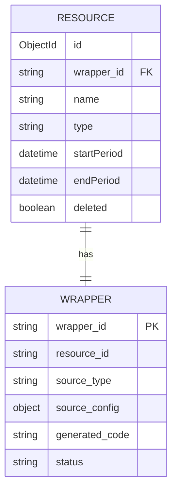

## What is a Resource?

A **resource** represents a sustainability indicator in the system. Each resource tracks a specific metric (like CO2 emissions, temperature, or economic indicators) and maintains metadata about the data being collected.

Resources serve as the public-facing entity that client applications interact with, while wrappers handle the behind-the-scenes data collection.

## Resource Schema

The resource data model is defined in `app/schemas/resource.py`:

```python
class ResourceBase(BaseModel):
    wrapper_id: str
    name: str
    type: str

class Resource(ResourceBase):
    id: PyObjectId
    startPeriod: Optional[datetime] = None
    endPeriod: Optional[datetime] = None
```

### Field Descriptions

<ParamField path="id" type="PyObjectId" required>
  Unique MongoDB ObjectId for the resource
</ParamField>

<ParamField path="wrapper_id" type="string" required>
  UUID of the associated wrapper that collects data for this resource
</ParamField>

<ParamField path="name" type="string" required>
  Human-readable name of the sustainability indicator
  
  **Examples:**
  - "CO2 Emissions - Manufacturing Sector"
  - "Average Temperature - Lisbon"
  - "Renewable Energy Percentage"
</ParamField>

<ParamField path="type" type="string" required>
  Classification of the resource. Typically `"sustainability_indicator"`
</ParamField>

<ParamField path="startPeriod" type="datetime" optional>
  Timestamp of the earliest data point collected. Initially `null`, updated when first data arrives
</ParamField>

<ParamField path="endPeriod" type="datetime" optional>
  Timestamp of the most recent data point collected. Updated continuously as new data arrives
</ParamField>

<ParamField path="deleted" type="boolean" default="false">
  Soft delete flag. Resources are never hard-deleted to maintain data integrity
</ParamField>

## Resource Lifecycle

### 1. Creation

Resources are typically created automatically when a wrapper is generated with `auto_create_resource: true`:

```python
async def create_resource(resource_data: ResourceCreate) -> Optional[dict]:
    wrapper_id = resource_data.wrapper_id
    
    # Validate wrapper exists
    wrapper = await db.generated_wrappers.find_one({"wrapper_id": wrapper_id})
    if not wrapper:
        raise ValueError(f"Wrapper with ID '{wrapper_id}' does not exist")
    
    # Create resource with initial null periods
    resource_dict = deserialize(resource_data.dict())
    resource_dict["deleted"] = False
    resource_dict["startPeriod"] = None
    resource_dict["endPeriod"] = None
    
    result = await db.resources.insert_one(resource_dict)
    return await get_resource_by_id(str(result.inserted_id))
```

<Info>
The system validates that the specified `wrapper_id` exists before creating a resource. This ensures referential integrity between resources and wrappers.
</Info>

### 2. Data Collection

Once created, the associated wrapper begins collecting data. As data points flow in:

1. Wrapper fetches data from its configured source
2. Data points are published to RabbitMQ queues
3. `startPeriod` and `endPeriod` are automatically updated
4. Data is routed to the data service for storage

### 3. Active Use

While active, resources can be:
- **Queried** via the REST API
- **Updated** to modify name or type
- **Monitored** for health and data collection status
- **Stopped** temporarily by stopping the wrapper

### 4. Deletion

Resources use **soft deletion** to preserve historical data:

```python
async def delete_resource(resource_id: str) -> Optional[ResourceDelete]:
    object_id = ObjectId(resource_id)
    resource = await db.resources.find_one({"_id": object_id})
    if not resource:
        return None
    
    # Soft delete the resource
    result = await db.resources.update_one(
        {"_id": object_id},
        {"$set": {"deleted": True}},
    )
    
    if result.modified_count > 0:
        wrapper_id = resource.get("wrapper_id")
        if wrapper_id:
            # Stop the wrapper process
            stopped = await wrapper_process_manager.stop_wrapper_process(wrapper_id)
            
            # Update wrapper status
            await db.generated_wrappers.update_one(
                {"wrapper_id": wrapper_id},
                {
                    "$set": {
                        "status": WrapperStatus.STOPPED.value,
                        "updated_at": datetime.utcnow(),
                    },
                    "$push": {"execution_log": log_entry},
                },
            )
            
            # Publish deletion event
            await rabbitmq_client.publish(
                settings.RESOURCE_DELETED_QUEUE,
                json.dumps({"resource_id": resource_id, "wrapper_id": wrapper_id}),
            )
```

<Warning>
Deleting a resource automatically stops its associated wrapper and publishes a deletion event to notify other services.
</Warning>

## Resource-Wrapper Relationship

Resources and wrappers have a **one-to-one relationship**:



**Key Points:**
- Each resource is linked to exactly one wrapper via `wrapper_id`
- The wrapper stores the `resource_id` for bidirectional navigation
- Resources represent the **what** (indicator being tracked)
- Wrappers represent the **how** (data collection mechanism)

## CRUD Operations

### Create

```python
resource_data = ResourceCreate(
    wrapper_id="a1b2c3d4-e5f6-7890-abcd-ef1234567890",
    name="Average Temperature - Lisbon",
    type="sustainability_indicator"
)
resource = await create_resource(resource_data)
```

### Read

```python
# Get single resource
resource = await get_resource_by_id(resource_id)

# List all resources with pagination
resources = await get_all_resources(skip=0, limit=10)
```

### Update

```python
update_data = ResourceUpdate(
    wrapper_id=resource.wrapper_id,  # Required but unchanged
    name="Monthly Average Temperature - Lisbon",  # Updated
    type="sustainability_indicator"
)
updated = await update_resource(resource_id, update_data)
```

<Note>
Partial updates are supported via `ResourcePatch`, which allows updating only specific fields without providing all required fields.
</Note>

### Delete

```python
result = await delete_resource(resource_id)
if result and result.deleted:
    print(f"Resource {resource_id} deleted successfully")
```

## Error Handling

The resource service implements comprehensive error handling:

```python
try:
    resource = await get_resource_by_id(resource_id)
except InvalidId as e:
    # Invalid ObjectId format
    logger.error(f"Invalid resource ID format: {resource_id}")
    raise ValueError(f"Invalid resource ID: {resource_id}")
except OperationFailure as e:
    # MongoDB operation failed
    logger.error(f"Database operation failed: {e}")
    raise
```

### Common Error Scenarios

<AccordionGroup>
  <Accordion title="Invalid Resource ID">
    **Error:** `ValueError: Invalid resource ID`
    
    **Cause:** Provided ID is not a valid MongoDB ObjectId
    
    **Solution:** Ensure the ID is a 24-character hexadecimal string
  </Accordion>

  <Accordion title="Wrapper Not Found">
    **Error:** `ValueError: Wrapper with ID 'xyz' does not exist`
    
    **Cause:** Attempting to create a resource for a non-existent wrapper
    
    **Solution:** Create the wrapper first, or verify the wrapper_id is correct
  </Accordion>

  <Accordion title="Duplicate Resource">
    **Error:** `ValueError: Resource with this identifier already exists`
    
    **Cause:** Database unique constraint violation
    
    **Solution:** Check for existing resources with the same wrapper_id
  </Accordion>
</AccordionGroup>

## Querying Resources

The service provides flexible querying capabilities:

```python
# Get all active (non-deleted) resources
resources = await db.resources.find({"deleted": False}).to_list(limit)

# Query by wrapper_id
resource = await db.resources.find_one({
    "wrapper_id": wrapper_id,
    "deleted": False
})

# Query by date range
resources = await db.resources.find({
    "deleted": False,
    "endPeriod": {"$gte": start_date, "$lte": end_date}
}).to_list(limit)
```

## Data Segments

While resources track metadata, actual data points are stored separately in data segments:

```python
class DataPoint(BaseModel):
    x: datetime | float  # Timestamp or numeric value
    y: float             # Measurement value

class TimePoint(BaseModel):
    x: datetime
    y: float

class DataSegment(BaseModel):
    resource_id: PyObjectId
    points: List[TimePoint]
    created_at: datetime
```

<Info>
Data segments are managed by a separate data service. Resources only track the time range (`startPeriod` to `endPeriod`) of collected data.
</Info>

## Best Practices

<Steps>
  <Step title="Always validate wrapper existence">
    Before creating a resource, ensure the associated wrapper exists and is properly configured.
  </Step>
  
  <Step title="Use meaningful names">
    Resource names should clearly describe what is being measured, including relevant context like location or timeframe.
  </Step>
  
  <Step title="Monitor period updates">
    Track `startPeriod` and `endPeriod` to ensure data collection is working as expected.
  </Step>
  
  <Step title="Implement soft deletes">
    Never hard-delete resources. Use the `deleted` flag to maintain historical records and data integrity.
  </Step>
  
  <Step title="Handle errors gracefully">
    Always catch and handle `InvalidId` and `OperationFailure` exceptions when working with resources.
  </Step>
</Steps>

## Next Steps

<CardGroup cols={2}>
  <Card title="Wrappers" icon="code" href="/concepts/wrappers">
    Learn how wrappers collect data for resources
  </Card>
  <Card title="Data Sources" icon="plug" href="/concepts/data-sources">
    Understand the different data source types
  </Card>
  <Card title="API Reference" icon="book" href="/api/resources/list">
    View the complete Resources API documentation
  </Card>
  <Card title="Architecture" icon="diagram-project" href="/concepts/architecture">
    Explore the overall system architecture
  </Card>
</CardGroup>