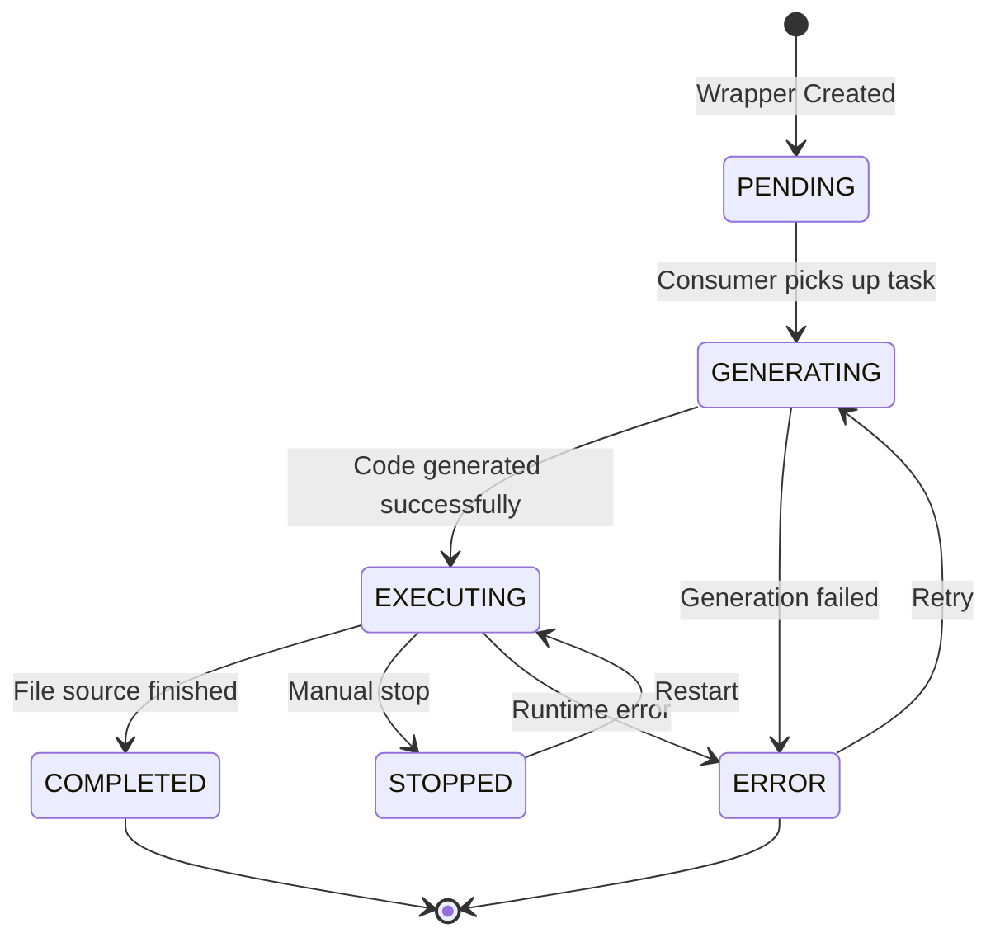

## What is a Wrapper?

A **wrapper** is an AI-generated Python script that collects data from a specific source (API, CSV, or XLSX) and publishes it to the system's message queue. Each wrapper is customized to:

- Understand the data source structure
- Extract relevant data points
- Handle authentication (for APIs)
- Manage execution checkpoints
- Publish data in a standardized format

Wrappers are the "workers" of the system, autonomously collecting and delivering sustainability indicator data.

## Wrapper Schema

The wrapper data model is defined in `app/schemas/wrapper.py`:

```python
class GeneratedWrapper(BaseModel):
    wrapper_id: str
    resource_id: Optional[str] = None
    metadata: IndicatorMetadata
    source_type: SourceType
    source_config: DataSourceConfig
    generated_code: Optional[str] = None
    created_at: datetime
    updated_at: datetime
    completed_at: Optional[datetime] = None
    status: WrapperStatus
    error_message: Optional[str] = None
    execution_log: list[str]
    
    # Monitoring
    last_health_check: datetime
    last_data_sent: Optional[datetime] = None
    data_points_count: int = 0
    monitoring_details: Dict[str, Any]
    
    # Checkpointing
    phase: WrapperPhase
    high_water_mark: Optional[datetime]
    low_water_mark: Optional[datetime]
```

## Wrapper Status

Wrappers progress through several states during their lifecycle:

```python
class WrapperStatus(str, Enum):
    PENDING = "pending"              # Created, waiting for generation
    GENERATING = "generating"        # AI is generating the code
    CREATING_RESOURCE = "creating_resource"  # Resource creation in progress
    EXECUTING = "executing"          # Actively running
    STOPPED = "stopped"              # Manually stopped
    COMPLETED = "completed"          # Finished (file-based sources)
    ERROR = "error"                  # Failed
```

### Status Flow Diagram



<Note>
API wrappers remain in `EXECUTING` status indefinitely (continuous collection), while CSV/XLSX wrappers transition to `COMPLETED` after processing all data.
</Note>

## Wrapper Phases

API wrappers operate in two phases for efficient data collection:

```python
class WrapperPhase(str, Enum):
    HISTORICAL = "historical"    # Collecting past data
    CONTINUOUS = "continuous"     # Real-time collection
```

**Phase Behavior:**

<Tabs>
  <Tab title="Historical Phase">
    - Collects all historical data from the earliest available point
    - Moves backward in time from the present
    - Updates `low_water_mark` as older data is collected
    - Transitions to continuous phase when historical data is complete
  </Tab>
  
  <Tab title="Continuous Phase">
    - Polls for new data at regular intervals (based on `periodicity`)
    - Only fetches data newer than `high_water_mark`
    - Updates `high_water_mark` as new data arrives
    - Runs indefinitely until manually stopped
  </Tab>
</Tabs>

## AI-Powered Generation

The `WrapperGenerator` class uses Google's Gemini AI to create customized wrappers:

### Generation Process

<Steps>
  <Step title="Sample Extraction">
    Extract a representative sample from the data source:
    
    ```python
    if source_type == "CSV":
        data_sample = self.get_csv_sample(source_config.location, max_lines=20)
    elif source_type == "XLSX":
        data_sample = self.get_xlsx_sample(source_config.location, max_lines_per_sheet=15)
    elif source_type == "API":
        data_sample = self.get_api_sample(source_config.location, auth_config, max_chars=2500)
    ```
  </Step>
  
  <Step title="Prompt Construction">
    Build a detailed prompt with:
    - Indicator metadata (name, domain, unit, periodicity)
    - Data sample structure
    - Source configuration
    - Wrapper template for the source type
    - Specific instructions for data extraction
  </Step>
  
  <Step title="AI Invocation">
    Call Gemini with tool support (for API sources):
    
    ```python
    if source_type == "API":
        generated_code = await self._call_model_with_tools(
            prompt=prompt,
            auth_config=auth_config,
            max_tool_calls=15,
            max_chars=2500,
            wrapper_id=wrapper_id,
        )
    else:
        generated_code = await self._call_model(prompt)
    ```
  </Step>
  
  <Step title="Code Validation">
    Validate the generated code for syntax and completeness:
    
    ```python
    def _validate_generated_code(self, generated_code: str) -> Optional[str]:
        try:
            ast.parse(generated_code)
        except SyntaxError as e:
            return f"SyntaxError at line {e.lineno}: {e.msg}"
        
        if re.search(r"^\s*\.\.\.\s*$", generated_code, re.MULTILINE):
            return "Unresolved placeholder '...' found in code"
        
        if "PLACEHOLDER" in generated_code:
            return "Unresolved PLACEHOLDER token found in code"
        
        return None
    ```
  </Step>
  
  <Step title="Error Recovery">
    If validation fails, retry with error feedback:
    
    ```python
    if lint_error:
        retry_prompt = self.prompt_manager.generate_wrapper_lint_retry_prompt(
            generated_code=generated_code,
            linting_errors=lint_error,
        )
        retry_response = await self._call_model(retry_prompt)
        generated_code = self._clean_code_response(retry_response)
    ```
  </Step>
  
  <Step title="Persistence">
    Save the validated code to disk:
    
    ```python
    wrapper_dir = "/app/generated_wrappers"
    file_path = os.path.join(wrapper_dir, f"{wrapper_id}.py")
    with open(file_path, "w", encoding="utf-8") as f:
        f.write(wrapper_code)
    ```
  </Step>
</Steps>

### Gemini Tool Support (API Sources)

For API sources, Gemini can use tools to explore the API during generation:

```python
config = types.GenerateContentConfig(
    tools=runtime.get_tools(),
    automatic_function_calling=types.AutomaticFunctionCallingConfig(disable=True),
    tool_config=types.ToolConfig(
        function_calling_config=types.FunctionCallingConfig(mode="AUTO")
    ),
)
```

**Available Tools:**
- `fetch_api_data`: Make sample API calls to understand response structure
- `parse_json`: Analyze JSON response formats
- `test_authentication`: Verify auth credentials work correctly

<Info>
Tool calls are limited to 15 per generation to prevent excessive API calls and ensure timely completion.
</Info>

## Indicator Metadata

Every wrapper is associated with rich metadata about the sustainability indicator:

```python
class IndicatorMetadata(BaseModel):
    name: str                    # "CO2 Emissions - Manufacturing"
    domain: str                  # "Environment"
    subdomain: str               # "Climate Change"
    description: str             # Detailed explanation
    unit: str                    # "tons CO2", "%", "°C"
    source: str                  # "European Environment Agency"
    scale: str                   # "National", "Regional", "Global"
    governance_indicator: bool   # True if measures governance
    carrying_capacity: Optional[float]  # Maximum sustainable value
    periodicity: str             # "Annual", "Monthly", "Daily"
```

**Periodicity Impact:**

The `periodicity` field determines the wrapper's polling frequency in continuous phase:

| Periodicity | Polling Interval | Use Case |
|-------------|------------------|----------|
| `Annual` | Every 30 days | Yearly reports, census data |
| `Monthly` | Every 7 days | Monthly statistics |
| `Weekly` | Every day | Weekly aggregates |
| `Daily` | Every 6 hours | Daily measurements |
| `Hourly` | Every hour | Real-time sensors |

## Wrapper Execution

Wrappers execute as separate Python processes managed by the `WrapperProcessManager`:

### Process Launch

```python
class ProcessWrapperRunner(WrapperRunner):
    async def execute_wrapper(
        self,
        wrapper: GeneratedWrapper,
        resume_phase: Optional[str] = None,
        resume_high_water_mark: Optional[str] = None,
        resume_low_water_mark: Optional[str] = None,
    ) -> WrapperExecutionResult:
        wrapper_file = f"/app/generated_wrappers/{wrapper.wrapper_id}.py"
        
        cmd = [
            "python",
            wrapper_file,
            "--wrapper-id", wrapper.wrapper_id,
            "--resource-id", wrapper.resource_id or "",
            "--mode", "continuous" if wrapper.source_type == SourceType.API else "once",
        ]
        
        if resume_phase:
            cmd.extend(["--resume-phase", resume_phase])
        if resume_high_water_mark:
            cmd.extend(["--resume-high-water-mark", resume_high_water_mark])
        
        process = await asyncio.create_subprocess_exec(
            *cmd,
            stdout=log_file,
            stderr=log_file,
        )
```

<Warning>
Each wrapper runs in its own process with isolated memory and resources. Crashed wrappers don't affect other wrappers or the main service.
</Warning>

### Checkpoint Management

Wrappers maintain execution state through checkpoints:

```python
# High Water Mark: Newest timestamp ever sent
high_water_mark: Optional[datetime] = None

# Low Water Mark: Oldest timestamp ever sent
low_water_mark: Optional[datetime] = None

# Current phase
phase: WrapperPhase = WrapperPhase.HISTORICAL
```

**Checkpoint Update Flow:**

1. Wrapper fetches new data points
2. Publishes data to RabbitMQ
3. Updates checkpoints in MongoDB:
   ```python
   await db.generated_wrappers.update_one(
       {"wrapper_id": wrapper_id},
       {
           "$set": {
               "high_water_mark": newest_timestamp,
               "low_water_mark": oldest_timestamp,
               "last_data_sent": datetime.utcnow(),
               "data_points_count": total_sent,
           }
       },
   )
   ```

### Resume After Restart

The service automatically resumes wrappers after a restart:

```python
async def restart_executing_wrappers(self):
    executing_wrappers = await db.generated_wrappers.find(
        {"status": "executing"}
    ).to_list(length=None)
    
    for wrapper_doc in executing_wrappers:
        wrapper = GeneratedWrapper(**wrapper_doc)
        
        # Skip if already running (process survived restart)
        if await self.is_wrapper_actively_executing(wrapper.wrapper_id):
            continue
        
        # Resume with saved checkpoints
        execution_result = await self._runner.execute_wrapper(
            wrapper,
            resume_phase=wrapper.phase.value,
            resume_high_water_mark=wrapper.high_water_mark.isoformat(),
            resume_low_water_mark=wrapper.low_water_mark.isoformat(),
        )
```

<Check>
Checkpoints ensure no data is duplicated or missed when wrappers restart, maintaining data integrity across service restarts.
</Check>

## Monitoring & Health

The system continuously monitors wrapper health:

### Health Metrics

```python
monitoring_details: Dict[str, Any] = {
    "process_id": 12345,
    "cpu_percent": 2.5,
    "memory_mb": 45.2,
    "uptime_seconds": 3600,
    "last_heartbeat": "2026-03-03T10:30:00Z",
}
```

### Health Status Levels

<AccordionGroup>
  <Accordion title="HEALTHY" icon="circle-check">
    - Process is running
    - Data sent within expected interval
    - No errors in recent logs
    - Resource usage within limits
  </Accordion>
  
  <Accordion title="DEGRADED" icon="circle-exclamation">
    - Process running but slow
    - Data delayed but still arriving
    - Minor errors in logs
    - High resource usage
  </Accordion>
  
  <Accordion title="STALLED" icon="circle-pause">
    - Process running but no data sent
    - Last data sent > 2x expected interval
    - Possible network or API issues
  </Accordion>
  
  <Accordion title="CRASHED" icon="circle-xmark">
    - Process not running
    - Recent fatal error
    - Requires manual intervention
  </Accordion>
</AccordionGroup>

## Debugging

The service provides comprehensive debugging capabilities:

### Debug Mode

Enable debug mode to save all AI prompts and responses:

```python
generator = WrapperGenerator(
    gemini_api_key=settings.GEMINI_API_KEY,
    debug_mode=True,
    debug_dir="/app/prompts"
)
```

**Debug Output Structure:**
```
/app/prompts/
  ├── {wrapper_id}/
  │   ├── prompt.txt              # Sent to Gemini
  │   ├── response.txt            # Gemini's response
  │   ├── metadata.json           # Generation context
  │   ├── generation_trace.json   # Tool calls & iterations
  │   └── lint_result.json        # Validation results
  └── {wrapper_id}_ERROR/
      └── error.txt               # Error details
```

### Execution Logs

Wrapper execution logs are saved to:

```
/app/wrapper_logs/{wrapper_id}.log
```

Access logs via the API:

```python
logs = await wrapper_service.get_wrapper_logs(wrapper_id, limit=100)
```

## Best Practices

<Steps>
  <Step title="Use descriptive metadata">
    Provide detailed, accurate indicator metadata. Better metadata leads to better AI-generated wrappers.
  </Step>
  
  <Step title="Test data sources first">
    Verify that your data source is accessible and returns valid data before creating a wrapper.
  </Step>
  
  <Step title="Monitor execution logs">
    Regularly check wrapper logs for errors or performance issues, especially after creation.
  </Step>
  
  <Step title="Leverage checkpoints">
    Don't manually reset checkpoints unless necessary. The system uses them to prevent duplicate data.
  </Step>
  
  <Step title="Enable debug mode during development">
    Use debug mode when testing new wrapper configurations to understand how the AI generates code.
  </Step>
</Steps>

## Next Steps

<CardGroup cols={2}>
  <Card title="Data Sources" icon="plug" href="/concepts/data-sources">
    Learn about supported data source types and configuration
  </Card>
  <Card title="Resources" icon="database" href="/concepts/resources">
    Understand how resources relate to wrappers
  </Card>
  <Card title="Create a Wrapper" icon="plus" href="/guides/generating-wrappers">
    Step-by-step guide to creating your first wrapper
  </Card>
  <Card title="Wrapper API" icon="book" href="/api/wrappers/list">
    View complete Wrapper API documentation
  </Card>
</CardGroup>