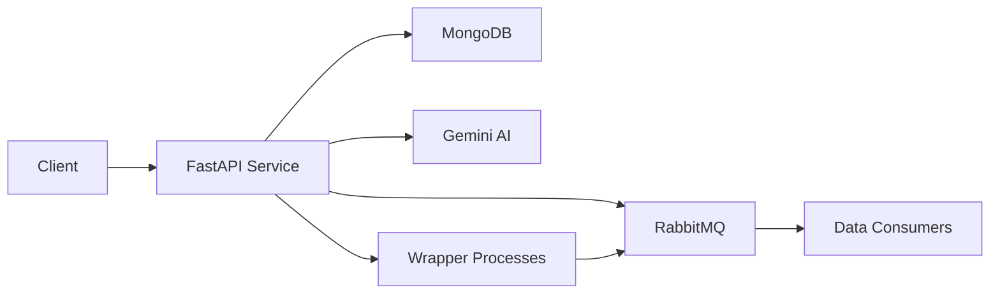

## Welcome to Resource Service

Resource Service is a FastAPI-based microservice designed for managing sustainability indicators through AI-generated data wrappers. It provides a comprehensive solution for collecting, processing, and distributing sustainability data from multiple sources including APIs, CSV files, and Excel spreadsheets.

<CardGroup cols={2}>
  <Card
    title="Quick Start"
    icon="rocket"
    href="/quickstart"
  >
    Get up and running in under 5 minutes with Docker Compose
  </Card>
  <Card
    title="Installation Guide"
    icon="download"
    href="/installation"
  >
    Detailed setup instructions for development and production environments
  </Card>
  <Card
    title="API Reference"
    icon="code"
    href="/api/resources/list"
  >
    Complete API documentation for all available endpoints
  </Card>
  <Card
    title="Core Concepts"
    icon="book"
    href="/concepts/architecture"
  >
    Understand resources, wrappers, and data collection workflows
  </Card>
</CardGroup>

## Key Features

<AccordionGroup>
  <Accordion icon="brain" title="AI-Powered Data Wrappers">
    Generate intelligent data collection wrappers using Google's Gemini AI. The service automatically creates Python code to fetch and process sustainability indicator data from various sources.
  </Accordion>

  <Accordion icon="database" title="Multi-Source Data Collection">
    Support for multiple data sources:
    - **API Integration**: Connect to REST APIs with flexible authentication (Bearer, API Key, Basic Auth)
    - **CSV Files**: Process uploaded CSV files with automatic validation
    - **Excel Spreadsheets**: Handle XLSX files with preview and validation
  </Accordion>

  <Accordion icon="clock" title="Historical & Continuous Monitoring">
    Wrappers operate in two phases:
    - **Historical Phase**: Collect all historical data from the source
    - **Continuous Phase**: Monitor for new data points in real-time
    
    Automatic checkpointing ensures resumable execution after service restarts.
  </Accordion>

  <Accordion icon="chart-line" title="Real-Time Health Monitoring">
    Monitor wrapper execution with detailed health status, logs, and metrics:
    - Process status tracking
    - Execution logs with timestamps
    - Data points count and timing information
    - High/low water marks for data synchronization
  </Accordion>

  <Accordion icon="message" title="Event-Driven Architecture">
    Built on RabbitMQ for reliable message passing:
    - Asynchronous wrapper generation
    - Data point streaming to consumers
    - Resource lifecycle events
    - Scalable and decoupled architecture
  </Accordion>
</AccordionGroup>

## Architecture Overview

The Resource Service is built with modern microservice patterns:



<CardGroup cols={3}>
  <Card title="FastAPI" icon="bolt">
    High-performance async API framework with automatic OpenAPI documentation
  </Card>
  <Card title="MongoDB" icon="database">
    Flexible document storage for resources, wrappers, and file metadata
  </Card>
  <Card title="RabbitMQ" icon="rabbit">
    Message broker for async operations and event streaming
  </Card>
</CardGroup>

## Use Cases

<Steps>
  <Step title="Environmental Data Collection">
    Collect air quality, water quality, and climate data from government APIs and research databases.
  </Step>
  
  <Step title="Social Indicators">
    Aggregate social sustainability metrics from CSV reports and Excel spreadsheets provided by organizations.
  </Step>
  
  <Step title="Economic Metrics">
    Monitor economic indicators through continuous API polling with automatic data validation.
  </Step>
  
  <Step title="Governance Tracking">
    Track governance and policy indicators with historical analysis and real-time updates.
  </Step>
</Steps>

## Technology Stack

<CodeGroup>

```python Core Dependencies
# Web Framework
fastapi==0.116.1
uvicorn==0.35.0

# Database
motor==3.7.1
pymongo==4.14.0

# Message Queue
aio-pika==9.5.7

# AI Integration
google-genai[aiohttp]>=0.3.0

# Data Processing
pandas>=2.0.0
openpyxl>=3.1.0
```

```yaml Docker Services
services:
  resource-service:
    - FastAPI application
    - Health checks
    - Volume mounts for wrappers
  
  resource-mongo:
    - MongoDB 7.x
    - Persistent storage
    - Health monitoring
```

</CodeGroup>

## What's Next?

<CardGroup cols={2}>
  <Card
    title="Get Started Now"
    icon="play"
    href="/quickstart"
  >
    Follow the quickstart guide to launch your first wrapper
  </Card>
  <Card
    title="Read the Installation Guide"
    icon="book-open"
    href="/installation"
  >
    Learn about detailed setup options and configuration
  </Card>
</CardGroup>

<Note>
  **Prerequisites**: Docker and Docker Compose are required. You'll also need a Google Gemini API key for AI-powered wrapper generation.
</Note>
